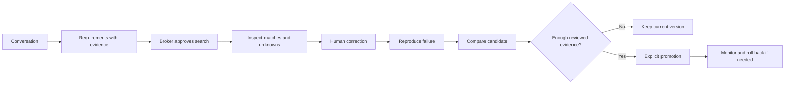

# Libbie Lab

**A property-broker workspace that demonstrates how to improve an AI system with evidence.**

Read a conversation, inspect the requirements, approve a property search, correct a mistake, and compare a candidate before releasing it.


Built with **Next.js · React · TypeScript · Motion · Radix UI · Lucide · SQLite**. Runs locally without an API key. All clients and listings are fictional; no real messages, payments, or bookings are sent.

## Start here

| What you need | Where to go |
| --- | --- |
| See the product | [Screenshot tour](docs/screenshots/README.md) |
| Run the full demonstration | [Step-by-step tutorial](docs/DEMO-TUTORIAL.md) |
| Read the case-study answer | [Four-section memo](docs/case-study-memo.md) |
| Check scope and limitations | [Case-study coverage](docs/case-study-coverage.md) |
| Explore all documentation | [Documentation index](docs/README.md) |

## The improvement loop



The app demonstrates the decision and rollback mechanics. Production monitoring and a broker pilot remain future work.

## What the demo proves

The baseline incorrectly reads **“We are not selling. We need to rent…”** as Seller. Candidate v3 handles that explicit negation. The reproducible development replay fixes **one case**, with **zero scripted regressions across 13 cases**. Promotion remains blocked without accepted human review.

This is a narrow, exposed development test—not an independent accuracy estimate. The supplied legacy CSV's **83.5% field agreement** and **48% whole-conversation agreement** describe the supplied system, not this app.


## Run

Use **Node 24 LTS** (tested with 24.16.0).

```sh
npm ci
npm run dev
```

Open http://127.0.0.1:3000. Database migration and idempotent fixture import run automatically. No API key is needed. `npm run seed` explicitly checks/imports the fixtures. There are 12 scenarios and 14 inventory records: 13 belong to the visible demo workspace and 1 tests workspace exclusion.

```sh
npm test                 # isolated temporary SQLite databases, never your demo DB
npm run evaluate         # stored paired replay + reports/scripted-replay.json
npm run build            # type check and production build
npm start                # serve the production build on loopback
```

The dependency lockfile is included. The supplied benchmark CSV, fictional fixtures, fonts and licenses are included. SQLite lives at `data/libbie.db`. Back up the whole data directory while the app is stopped. Restarting never reseeds over existing conversations. `LIBBIE_DB` can choose another database file. Its parent directory must exist.

## Five-minute demo

1. **Workspace** opens the family lead. Read the source quotes: 5 bedrooms, garden, pool, 2 dogs, around AED 500k/year, before mid-August. Arabian Ranches is unconfirmed. The fictional recreation supplies the year 2026.
2. **Ask Libbie → Review search**. Enter `Arabian Ranches` as a broker-approved working area, keep AED 500,000/year, check the approval box, and **Run search**. SYN-P001 is conditional: style uncertain, pets and availability unverified. SYN-P004 is a separate factual match. All cards come from canonical inventory records.
3. **Draft reply**, edit it to ask whether Mudon works, and **Send to simulated client**. Use **Save draft** to preserve unfinished drafts. These messages are local events only.
4. In **Scenario Lab**, **Start / resume**, choose `confirm_area`, and **Next client reply**. Mudon becomes accepted and Arabian Ranches rejected. Ask about the budget in Workspace, then use `ask_budget` to disclose the AED 520k maximum. Revisit Workspace and run a fresh approved search. Stale briefs are rejected.
5. Ask for Saturday at 10:00, then use `ask_viewing_time`. The stage advances to Viewing. **Correct** lets you fix a field with a source message and reason. The override persists through later messages and creates a development feedback case.
6. **Review** separates source evidence, machine proposals and saved human references. Use blind mode before forming an independent answer. Review all 12 frozen openings to make a demo report eligible. Do not accept values without reviewing evidence. Ambiguous/adjudication cases do not count as accepted.
7. **Evaluation → Run comparison** freezes the actual transcript/reference and inventory hashes for v1 and v2. The supplied unreviewed fixtures correctly produce **Insufficient evidence**, even when all scripted assertions pass. After genuine review, a passing exact-source report enables explicit promotion. **Rollback previous promotion** restores the prior pointer and keeps the audit trail.
8. Restart and confirm the conversation, correction, review, comparison and version history remain.

The 5-minute path demonstrates the mechanics, not enough time for independent review of every reference. The automated test suite exercises promotion and rollback using an explicitly named test actor in a temporary database; it does not fabricate human validation in your workspace.

## Optional live provider

Copy `.env.example` to `.env.local`, set `APP_MODE=live`, `MODEL_PROVIDER=openai`, `MODEL_API_KEY`, `SIMULATOR_MODEL` and `RUNTIME_MODEL`, then restart. Pick model IDs your account actually supports. No model availability or price is assumed. Credentials are server-only and never returned to the UI.

Live mode uses the OpenAI Responses API for **client simulation** and **broker draft replies**, with role-specific prompts, strict JSON schema, Zod validation, timeout, bounded transient retries and one schema-repair attempt. Actual model, request ID, latency and supplied usage are saved. Cost is unavailable unless a future explicit price table is added. The live simulator receives only its persona, disclosure rules, public transcript and clock. The assistant receives only the public transcript and lead snapshot. Neither receives evaluator answers.

Live calls run as persisted jobs outside database transactions. The page polls while work is active. A paused run is checked before append. An expired lease is recoverable on the next page request after restart. Provider errors stay failed, expose Retry, and never become a scripted response. No real-provider call was made during delivery; adapter behavior was tested with injected success, malformed-output and timeout responses.

**Extraction, search filtering/ranking, enrichment and paired evaluation remain explicitly deterministic in both modes.** Live clients do not make scripted evaluation evidence live-model certification. `TEACHER_MODEL` and `JUDGE_MODEL` are reserved configuration and currently have no execution workflow.

## Explore the approach

Read the [case-study memo](docs/case-study-memo.md) for the proposed evaluation and improvement programme, then follow the [client walkthrough](docs/DEMO-TUTORIAL.md). `npm run demo:report` reproduces the synthetic before/after comparison without changing your workspace.

## Repository checks

GitHub Actions runs the isolated test suite and production build on pushes to `main` and pull requests. Local databases, credentials, dependencies, and build output are excluded from Git. This prototype binds to loopback and is not configured for a public production deployment.

## Documentation

- [Architecture and API](docs/architecture.md)
- [Coverage and known limitations](docs/coverage.md)
- [Evaluation policy](docs/evaluation-policy.md)
- [Generated scripted replay](reports/scripted-replay.json)

Implementation references checked during the build: [Next.js Route Handlers](https://nextjs.org/docs/app/api-reference/file-conventions/route), [Zod parsing](https://zod.dev/basics), and [OpenAI Responses API](https://developers.openai.com/api/reference/typescript/resources/beta/subresources/responses/methods/create).

## Repository map

```text
app/                    Screens, components, styles, and API route
src/                    Conversation rules, search, storage, jobs, evaluation
migrations/             SQLite schema
prompts/                Versioned provider prompts
fixtures/               Additional reproducible improvement case
libbie-mvp-handoff/     Extracted original scenarios, inventory, and assets
reports/                Generated replay evidence
tests/                 Isolated behavior and integration checks
docs/                  Approach, walkthrough, coverage, screenshots
.github/workflows/      Automated test and build checks
```

Supplied asset licenses remain with their source files.

## Contact

**Ivan Židov · TextValue**

[ivan@textvalue.ai](mailto:ivan@textvalue.ai) · [LinkedIn](https://www.linkedin.com/in/ivan-zidov/)
