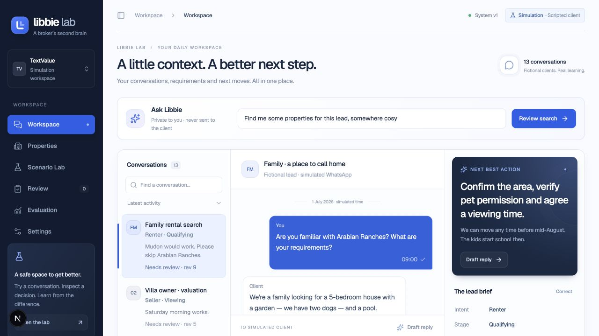
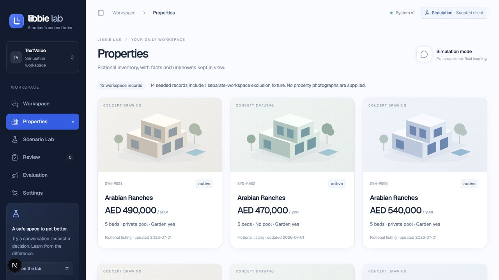
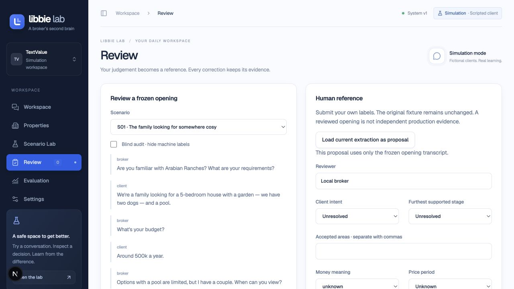
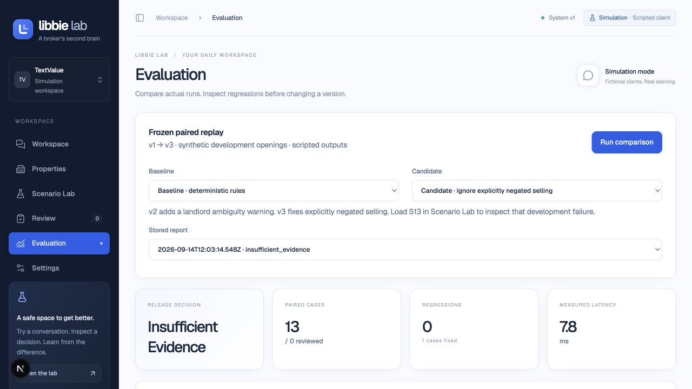

# A quick tour

These are actual screenshots of the local app, captured on 14 September 2026. All conversations and properties are fictional. They show an example workspace with optional scenario S13 loaded, so a fresh installation starts with one fewer conversation. The small Next.js development indicator is visible because these were captured from the development server.

## 1. Understand the conversation

The broker sees the conversation and its current lead brief together. Ask Libbie is private to the broker. Source messages determine requirements; accepted and rejected areas remain distinct.

## 2. Inspect properties

The inventory uses stable property IDs and explicit facts. Open a card to inspect details. The drawings are labeled concepts, not photographs; missing pet permission or availability must still be verified.

## 3. Review the evidence

Human references are separate from machine proposals. A reviewer can use blind mode and record accepted, ambiguous, or adjudication status. Unresolved cases cannot be treated as accepted evidence.

## 4. Compare before releasing

The displayed v1 → v3 replay fixes one exposed development failure across 13 cases, with no scripted regressions. It still reports **Insufficient evidence** because zero cases have accepted human references. This is a working release safeguard, not a claim of production quality. The displayed latency belongs to this stored deterministic run.

Follow the [tutorial](../DEMO-TUTORIAL.md) to reproduce the full flow.
